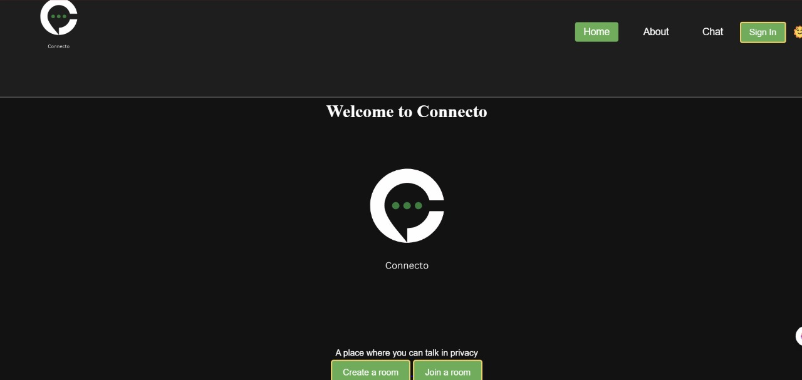
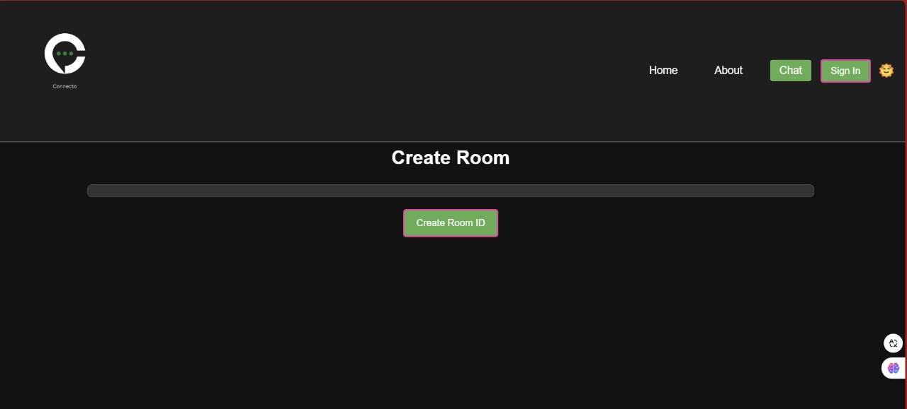
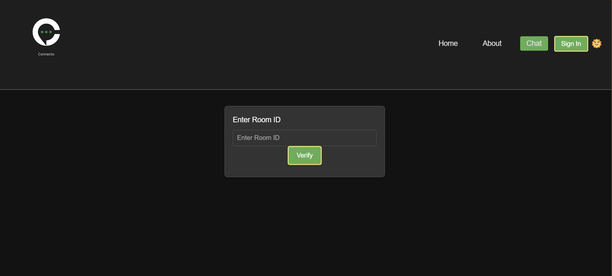
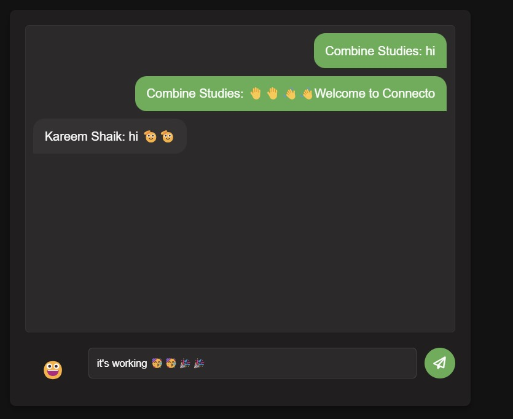

# Connecto

## Introduction

Connecto is a simple but efficient web application app where you can chat with your friends in private without any fear of leaking of data and data mining by few large companies. Connecto is designed to be used for chatting in privacy.

## Features

<ol>
<li>Messaging</li>
<li>Option to send Emoji</li>
<li>Creating of room id </li>
</ol>

## Important requirements

In order to use our website you need to have a google account to sign in

## Requirements to use the code

To use this code you need following requirements :

<ol>
<li>An Editor (like vs code editor)</li>
<li>Installed Html and css </li>
<li>Go live or microsoft preview </li>
<li>Latest version if JS (Node js should be there in the computer)</li>
<li>Internet Connection</li>
<li>Firebase Installed With configuration file </li>
<li>Nano id module installed </li>
</ol>

## Screenshots of the website

<ul>
<li><b>Home Page: </b></li>
<li><b>Room Creating Page: </b></li>
<li><b>Room verifier Page: </b></li>
<li><b>Chat Page: </b></li>
</ul>

> [!Note]
> This is the website link : https://connectochat.netlify.app/

> [!IMPORTANT]  
> Important alert create a firebaseConfig.mjs file and create a firebaseConfig variable and store your config data in it
